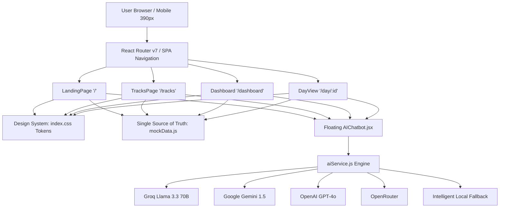

# 🚀 ABTalks 60-Day Coding Challenge Platform — Master Prompt & Specification (`PROMPT.md`)

> **The Definitive System Prompt, Architectural Blueprint, and Reproduction Guide**  
> *From Concept to Production — A Mobile-First, High-Trust Proof-of-Work Platform for Indian Engineering Students.*

---

## 📑 Table of Contents
1. [Executive Summary & North Star](#1-executive-summary--north-star)
2. [Master System Prompt (One-Shot Blueprint)](#2-master-system-prompt-one-shot-blueprint)
3. [Architectural Invariants & Tech Stack](#3-architectural-invariants--tech-stack)
4. [Brand Design System & Tokens](#4-brand-design-system--tokens)
5. [Complete Data Schemas (`mockData.js`)](#5-complete-data-schemas)
6. [Route-by-Route Feature Specifications](#6-route-by-route-feature-specifications)
   - [Route 1: `/` Landing Page (Editorial Light Mode)](#route-1--landing-page)
   - [Route 2: `/tracks` Career Tracks Explorer](#route-2-tracks-career-tracks-explorer)
   - [Route 3: `/dashboard` Late-Night Sandbox Dashboard](#route-3-dashboard-late-night-sandbox)
   - [Route 4: `/day/:id` Daily Proof of Work Console](#route-4-dayid-daily-proof-of-work-console)
7. [AI Rebel Mentor Service Architecture](#7-ai-rebel-mentor-service-architecture)
8. [Value-Add Innovation: Night Owl Mode 🦉](#8-value-add-innovation-night-owl-mode-)
9. [Step-by-Step Phased Reproduction Prompts](#9-step-by-step-phased-reproduction-prompts)
10. [Production Deployment & Environment Setup](#10-production-deployment--environment-setup)

---

## 1. Executive Summary & North Star

### 🎯 The Mission
Indian engineering education is trapped in "Tutorial Hell" and outdated rote learning. Over **1.5 million engineers graduate annually**, yet less than 10% possess real-world, production-grade shipping skills. 

**ABTalks 60-Day Coding Challenge** is a mobile-first, high-trust digital platform engineered to eliminate choice paralysis, project unshakeable *"we handle everything"* energy, and ensure that every late-night coding session on a mobile phone or laptop directly converts into **daily proof of work**, GitHub commits, LinkedIn visibility, and recruiter interest.

### 🌟 North Star Principles
1. **Frictionless Daily Commitment**: 0 to submitted in under 3 minutes per day on mobile.
2. **Deterministic Over Speculative**: Instant visual feedback, zero ambiguous states, mock-powered resilience.
3. **Warm & Late-Night Supportive**: Always encouraging, especially at 2:00 AM. Missed days are treated as "Rest Days", not failures.
4. **Dual-Atmosphere Design**:
   - **Landing Page**: Light, vibrant, editorial, NYC subway/bold poster aesthetic (high conversion).
   - **Dashboard & Day Views**: Deep dark "Late-Night Sandbox" (`#0B0D12`) tailored for nighttime focus and high dopamine retention.

---

## 2. Master System Prompt (One-Shot Blueprint)

> **Copy and paste the prompt below into any AI agent (Claude 3.7 / Gemini 2.0 / GPT-4o) to generate this entire repository from scratch:**

```markdown
You are an elite Principal Frontend Architect and Product Designer. Build a complete, production-ready, mobile-first SaaS web platform for the "ABTalks 60-Day Coding Challenge" using Vite + React 19 + React Router v7 + Vanilla CSS (No Tailwind, no external UI component libraries).

### CORE SPECIFICATIONS:
1. ARCHITECTURE & DESIGN SYSTEM:
   - Light Mode for Landing Page (`/`): Crisp `#FFFFFF` canvas, bold `#0A0A0A` headlines, electric `#FFD600` yellow badge buttons, editorial black borders, bold all-caps display typography.
   - Dark Mode for Dashboard (`/dashboard`), Tracks (`/tracks`), and Day View (`/day/:id`): Deep `#0B0D12` canvas, `#151821` glass cards, neon track accents (`#F97316` Fullstack, `#10B981` AI/ML, `#3B82F6` Data Eng, `#EF4444` DSA).
   - 100% Mobile-first responsive (strictly functional at 390px viewport width without ANY horizontal overflow) through fluid desktop scaling.

2. REQUIRED ROUTES & FEATURES:
   - Route `/` (Landing Page): Hero with dynamic stats, 2-column "Traditional College vs ABTalks Path" comparison, 4 interactive track cards with salary & hiring tags, 60-day interactive preview, FAQ accordion, testimonials, sticky bottom mobile CTA bar.
   - Route `/tracks` (Career Tracks Explorer): 4 full tracks with interactive tab switcher, automatic smooth scroll-into-view to the detail card on mobile, 60-day curriculum module breakdown, capstone project preview, full tech stack badges, alumni hiring logos, and 1-click enrollment.
   - Route `/dashboard` (Late-Night Sandbox): User profile banner with college & track badges, streak fire flame counter (`12 Days`), XP counter (`1450 XP`), Rank (`#42`), Today's Task card with direct "START TODAY'S CHALLENGE →" routing, 60-day interactive heatmap grid (completed, today, missed, upcoming), interactive badge showcase shelf with details drawer, community leaderboard, and recent activity feed. 4 mobile filter tabs ("Today", "60-Day Map", "Badges", "All") with 0 horizontal overflow.
   - Route `/day/:id` (Daily Proof of Work Console): Day navigation (`← Day 12 / ALL DAYS / Day 14 →`), challenge details & learning objectives, XP reward callout (`+165 XP`), quick-fill templates button for GitHub commits & LinkedIn post text, interactive submission form with URL validation, reflection text area, and 5-emoji mood picker (`🤩 excited`, `😎 confident`, `🧠 focused`, `😤 struggling`, `😴 tired`). Completed states show verified proof badges; missed days show warm encouragement ("Rest Day"); locked days show upcoming state.

3. VALUE-ADD INNOVATIONS:
   - AI Rebel Mentor Floating Chatbot: Embedded multi-provider LLM service connecting seamlessly to Groq Cloud (Llama 3.3 70B), Google Gemini 1.5, OpenAI GPT-4o, or OpenRouter via client environment variables (`VITE_AI_API_KEY`, `VITE_GEMINI_API_KEY`, `VITE_OPENAI_API_KEY`), with intelligent local engine fallback for instant responses when offline.
   - Night Owl Mode: Automatic detection past 10:00 PM IST shifting ambient colors to warm tones (`#0D0D14` / `#E8E4D9` / `#8B7FFF`), displaying empathetic late-night encouraging banners ("You're putting in the work while others sleep.").

4. DATA & RELIABILITY:
   - Standalone `src/data/mockData.js` acting as single source of truth with 60 comprehensive day entries, 4 career tracks, complete user state, badges, and FAQs.
   - Zero external UI libraries. Pure semantic HTML5 + Vanilla CSS custom properties.
   - All tests, builds (`npm run build`), and navigation flows must execute cleanly without runtime warnings or unhandled exceptions.
```

---

## 3. Architectural Invariants & Tech Stack



### 📦 Technology Matrix
| Layer | Choice | Rationale |
|---|---|---|
| **Framework** | React 19 + Vite 6 | Sub-second HMR, modern JSX runtime, tiny bundle footprint (~98 kB gzip). |
| **Routing** | React Router v7 | Instant client-side navigation with URL parameters (`/day/:id`). |
| **Styling** | Pure Vanilla CSS | Custom CSS variables design tokens, zero build-step overhead, 100% control over mobile responsiveness and dark mode contrast. |
| **State & Data** | `src/data/mockData.js` | Zero database requirement; deterministic, instant rendering for static deployments. |
| **AI Integration** | `src/services/aiService.js` | Multi-LLM provider switchboard supporting Groq, Gemini, OpenAI, OpenRouter, and local fallback. |

---

## 4. Brand Design System & Tokens

Defined globally in `src/index.css`:

```css
:root {
  /* === LIGHT MODE — LANDING PAGE === */
  --landing-bg: #FFFFFF;
  --landing-surface: #F8F9FA;
  --landing-text-primary: #0A0A0A;
  --landing-text-secondary: #4A4A4A;
  --landing-accent-blue: #1A1A6E;
  --landing-accent-yellow: #FFD600;
  --landing-card-border: #E5E7EB;

  /* === DARK MODE — DASHBOARD & SANDBOX === */
  --dark-bg: #0B0D12;
  --dark-surface: #151821;
  --dark-surface-hover: #1C1F2E;
  --dark-glass: rgba(255, 255, 255, 0.05);
  --dark-border: rgba(255, 255, 255, 0.08);
  --dark-text-primary: #F0F0F5;
  --dark-text-secondary: #8B8FA3;
  --dark-text-muted: #565B6E;

  /* === TRACK NEON ACCENTS === */
  --track-fullstack: #F97316;     /* Full-Stack Orange */
  --track-vibe-coding: #3B82F6;   /* Data Eng Blue */
  --track-agentic-ai: #10B981;    /* AI/ML Emerald */
  --track-dsa: #EF4444;           /* DSA Crimson */

  /* === STATUS & RETENTION TOKENS === */
  --color-success: #4ADE80;
  --color-warning: #FBBF24;
  --color-error: #F87171;
  --color-streak: #FF6B35;        /* Flame Orange */
  --color-xp: #A78BFA;            /* Electric Purple */

  /* === NIGHT OWL CIRCADIAN TOKENS === */
  --nightowl-bg: #0D0D14;
  --nightowl-surface: #161822;
  --nightowl-text: #E8E4D9;
  --nightowl-accent: #8B7FFF;

  /* === TYPOGRAPHY HIERARCHY === */
  --font-display: 'Inter', system-ui, -apple-system, sans-serif;
  --font-body: 'Inter', system-ui, -apple-system, sans-serif;
  --font-mono: 'JetBrains Mono', 'Fira Code', monospace;
  --fw-regular: 400;
  --fw-medium: 500;
  --fw-semibold: 600;
  --fw-bold: 700;
  --fw-black: 900;

  /* === SPACING SCALE (4px BASE) === */
  --space-1: 0.25rem;  /* 4px */
  --space-2: 0.5rem;   /* 8px */
  --space-3: 0.75rem;  /* 12px */
  --space-4: 1rem;     /* 16px */
  --space-6: 1.5rem;   /* 24px */
  --space-8: 2rem;     /* 32px */
  --space-12: 3rem;    /* 48px */
  --space-16: 4rem;    /* 64px */

  /* === RADII === */
  --radius-sm: 8px;
  --radius-md: 12px;
  --radius-lg: 16px;
  --radius-xl: 24px;
  --radius-full: 9999px;
}
```

---

## 5. Complete Data Schemas

The mock database is centralized in `src/data/mockData.js`.

### 5.1 User Profile (`userData`)
```javascript
export const userData = {
  id: "u_001",
  name: "Aryan Sharma",
  avatar: "https://api.dicebear.com/7.x/avataaars/svg?seed=aryan",
  college: "IIT Delhi",
  track: "Full-Stack Developer",
  joinedDate: "2026-07-27",
  bio: "Building cool stuff, one commit at a time.",
  github: "https://github.com/aryan",
  linkedin: "https://linkedin.com/in/aryan",
  currentStreak: 12,
  longestStreak: 12,
  totalDaysCompleted: 12,
  totalDaysInChallenge: 60,
  rank: 42,
  totalParticipants: 1200,
  xp: 1450,
  badges: [
    { id: "b_01", name: "First Commit", icon: "🔥", description: "Shipped your very first proof of work.", earnedOn: "2026-07-27", locked: false },
    { id: "b_02", name: "7-Day Streak", icon: "⚡", description: "Maintained momentum for a full unbroken week.", earnedOn: "2026-08-02", locked: false },
    { id: "b_03", name: "Community Star", icon: "⭐", description: "Helped 5 fellow students in Discord.", earnedOn: "2026-08-05", locked: false },
    { id: "b_04", name: "Night Owl", icon: "🦉", description: "Shipped a commit past midnight IST.", earnedOn: "2026-08-07", locked: false },
    { id: "b_05", name: "API Architect", icon: "🛠️", description: "Built and deployed a live REST API.", earnedOn: null, locked: true },
    { id: "b_06", name: "60-Day Titan", icon: "👑", description: "Completed the entire 60-day challenge.", earnedOn: null, locked: true }
  ]
};
```

### 5.2 4 Career Tracks Schema (`tracks`)
```javascript
export const tracks = [
  {
    id: "t_01",
    name: "Full-Stack Developer",
    tagline: "Stop Consuming. Start Shipping.",
    description: "Build and deploy real production products, end-to-end with React, Node, MongoDB, and AWS.",
    icon: "🌐",
    color: "#F97316",
    totalDays: 60,
    difficulty: "Intermediate",
    participants: 380,
    salary: "₹14 - ₹28 LPA",
    tags: ["React 19", "Node.js", "Express", "MongoDB", "PostgreSQL", "Docker", "AWS", "Vercel"],
    modules: [
      { week: "Weeks 1–2 (Days 1–15)", title: "Frontend Architecture & Modern JS", description: "Deep dive into React 19, custom hooks, state machines, and micro-animations." },
      { week: "Weeks 3–4 (Days 16–30)", title: "Backend Systems & REST/GraphQL", description: "Express, Node.js concurrency, auth with JWT & OAuth2, database indexing." },
      { week: "Weeks 5–6 (Days 31–45)", title: "Databases, ORMs & Caching", description: "PostgreSQL, Prisma, Redis caching layer, and transaction isolation levels." },
      { week: "Weeks 7–8 (Days 46–60)", title: "DevOps, CI/CD & Capstone Shipping", description: "Docker containers, GitHub Actions, cloud deployment, and performance audit." }
    ],
    projects: ["DevSync — Real-time Code Collaboration", "FinTrack — High-throughput Expense API", "SaaS Boilerplate with Stripe Billing"],
    skills: ["Full-Stack Architecture", "REST & WebSockets", "SQL & NoSQL", "Docker Containerization"],
    hiringAt: ["Razorpay", "Swiggy", "Postman", "BrowserStack", "CRED"]
  },
  {
    id: "t_02",
    name: "AI / ML Engineer",
    tagline: "Don't Just Use AI. Build It.",
    description: "Train, fine-tune, and ship intelligent systems. From neural networks to production ML pipelines.",
    icon: "🧠",
    color: "#10B981",
    totalDays: 60,
    difficulty: "Advanced",
    participants: 290,
    salary: "₹18 - ₹35 LPA",
    tags: ["Python", "PyTorch", "Hugging Face", "LangChain", "OpenAI", "Vector DBs", "FastAPI"],
    modules: [
      { week: "Weeks 1–2 (Days 1–15)", title: "Deep Learning & PyTorch Foundations", description: "Build neural networks from scratch, backpropagation calculus, and tensor optimization." },
      { week: "Weeks 3–4 (Days 16–30)", title: "Transformers & Hugging Face Ecosystem", description: "Fine-tune BERT & LLaMA models, tokenization, LoRA/QLoRA adapters." },
      { week: "Weeks 5–6 (Days 31–45)", title: "RAG & Agentic Systems", description: "Build multi-agent workflows with LangGraph, hybrid search vector embeddings, and chunking." },
      { week: "Weeks 7–8 (Days 46–60)", title: "Production Model Serving", description: "FastAPI inference endpoints, vLLM acceleration, model quantization, and monitoring." }
    ],
    projects: ["Autonomous Research Subagent", "Multimodal Semantic Search Engine", "Local LLM Fine-Tuned on Legal Docs"],
    skills: ["PyTorch & Transformers", "RAG & Vector Databases", "Agentic Orchestration", "MLOps & Quantization"],
    hiringAt: ["Sarvam AI", "Krutrim", "Google", "Microsoft", "Jio AI Labs"]
  },
  {
    id: "t_03",
    name: "Data Engineer",
    tagline: "Power Every AI With Clean Data.",
    description: "Build the resilient distributed pipelines that process terabytes of data across the world.",
    icon: "💎",
    color: "#3B82F6",
    totalDays: 60,
    difficulty: "Intermediate",
    participants: 210,
    salary: "₹12 - ₹24 LPA",
    tags: ["SQL", "Apache Spark", "Airflow", "Snowflake", "dbt", "Kafka", "AWS S3"],
    modules: [
      { week: "Weeks 1–2 (Days 1–15)", title: "Advanced SQL & Data Modeling", description: "Window functions, star vs snowflake schemas, partition strategies, query tuning." },
      { week: "Weeks 3–4 (Days 16–30)", title: "Distributed Processing with Spark", description: "PySpark DataFrames, shuffling bottlenecks, memory management, and Delta Lake." },
      { week: "Weeks 5–6 (Days 31–45)", title: "Orchestration & Streaming", description: "DAG design in Apache Airflow, real-time message streaming with Apache Kafka." },
      { week: "Weeks 7–8 (Days 46–60)", title: "Modern Data Stack & Analytics Engineering", description: "Transformations with dbt, Snowflake warehousing, data quality testing with Great Expectations." }
    ],
    projects: ["Real-Time E-Commerce Clickstream Pipeline", "Lakehouse Analytics Platform with dbt", "Automated ETL Health & Anomaly Detector"],
    skills: ["Distributed Computing (Spark)", "Stream Processing (Kafka)", "Data Warehousing (Snowflake)", "Workflow Orchestration (Airflow)"],
    hiringAt: ["Walmart Global Tech", "Flipkart", "Fractal", "Tiger Analytics", "Amazon"]
  },
  {
    id: "t_04",
    name: "Advanced DSA",
    tagline: "Crack The Code. Land The Job.",
    description: "Master data structures, algorithms, and system architecture to ace tier-1 placement interviews.",
    icon: "⚔️",
    color: "#EF4444",
    totalDays: 60,
    difficulty: "Advanced",
    participants: 450,
    salary: "₹16 - ₹32 LPA",
    tags: ["C++", "Java", "Graphs", "Dynamic Programming", "Trees", "Tries", "System Design"],
    modules: [
      { week: "Weeks 1–2 (Days 1–15)", title: "Arrays, Two-Pointers & Sliding Window", description: "Master monotonic queues, sliding window optimizations, bit manipulation tricks." },
      { week: "Weeks 3–4 (Days 16–30)", title: "Trees, Tries & Graph Traversals", description: "Binary lifting for LCA, Trie prefix search, Dijkstra, topological sort, Disjoint Set Union." },
      { week: "Weeks 5–6 (Days 31–45)", title: "Dynamic Programming Masterclass", description: "0/1 Knapsack variations, DP on Trees, bitmask DP, digit DP, and state compression." },
      { week: "Weeks 7–8 (Days 46–60)", title: "Advanced Strings & Mock Interviews", description: "KMP, Z-algorithm, segment trees with lazy propagation, and FAANG mock sessions." }
    ],
    projects: ["Custom Memory Allocator & Garbage Collector", "Real-Time Shortest Path Navigator", "High-Performance Cache Engine"],
    skills: ["Competitive Programming", "Graph Theory & Trees", "Advanced Dynamic Programming", "Interview Problem Intuition"],
    hiringAt: ["Atlassian", "Uber", "Tower Research", "De Shaw", "Adobe"]
  }
];
```

### 5.3 60-Day Day Entry Schema (`dayEntries`)
Each day object features rich contextual learning content:
```javascript
{
  dayNumber: 13,
  date: "2026-08-08",
  status: "pending", // 'completed' | 'pending' | 'missed' | 'locked'
  title: "Authentication with JWT & Bcrypt",
  description: "Implement user authentication using JSON Web Tokens, password hashing with bcrypt, and protected route middleware.",
  learningObjectives: [
    "Understand the core concepts of authentication with JWT",
    "Implement secure password hashing with bcrypt",
    "Submit a working GitHub commit as proof of work"
  ],
  submission: null, // Populated on completion with { githubCommitUrl, githubCommitMessage, linkedinPostUrl, linkedinPostPreview, submittedAt }
  reflection: null,
  mood: null,
  xpReward: 165,
  streakAtCompletion: 13
}
```

---

## 6. Route-by-Route Feature Specifications

### Route 1: `/` (Landing Page)
- **Aesthetic**: Editorial Light Mode with yellow badge accents and black borders.
- **Hero Section**: Bold headline `STOP STUDYING IN SECRET. START SHIPPING IN PUBLIC.`, dynamic animated counter badges, and dual primary CTAs (`JOIN THE CHALLENGE →` and `EXPLORE 4 TRACKS ⚡`).
- **Comparison Matrix**: 2-column comparison showing the traditional college engineering path vs. the ABTalks proof-of-work path.
- **Tracks Showcase Grid**: 4 cards with difficulty ratings, student counts, salary potential, and tech stack pills.
- **Interactive 60-Day Preview**: Visual preview of what daily commits look like.
- **FAQ Accordion**: 6 collapsible items covering eligibility, time commitment, job guarantees, and college exams.
- **Sticky Mobile Bottom Bar**: Direct CTA button anchored to viewport bottom on mobile screens.

### Route 2: `/tracks` (Career Tracks Explorer)
- **Aesthetic**: Dark Mode with neon track accents.
- **Track Selection Tabs**: 4 horizontal/vertical tabs with student counts and active track badges.
- **Auto-Scroll Behavior**: Selecting a track triggers `scrollIntoView({ behavior: 'smooth', block: 'start' })` ensuring mobile users immediately see the detail card without manual scrolling.
- **Sub-Tabs**:
  1. `60-Day Curriculum`: 4 weekly modules with deep breakdown.
  2. `Capstone Projects`: 3 production-grade project descriptions.
  3. `Skills & Tech Stack`: Mastered skills, full stack tags, and hiring alumni company badges.
- **Action**: 1-click `START THIS TRACK →` dynamically sets the user's active track and navigates to `/dashboard`.

### Route 3: `/dashboard` (Late-Night Sandbox)
- **Aesthetic**: Deep dark canvas (`#0B0D12`) with glassmorphic cards.
- **Profile Header**: Name, college badge, active track badge with quick-switch link, streak counter, XP total, and leaderboard rank.
- **Today's Task Card**: Shows Day 13 status, title, description, and direct yellow button `START TODAY'S CHALLENGE →` (navigating to `/day/13`).
- **4 Mobile Tabs**:
  1. `Today`: TaskCard + StreakCard.
  2. `60-Day Map`: Full 60-day interactive heatmap grid with color-coded day cells.
  3. `Badges`: Interactive badge shelf with unlocked/locked milestones and detail preview.
  4. `All`: Multi-column stacked view of all components.
- **Sidebar**: Community Board with top percentiles and live Discord/LinkedIn links, plus Recent Activity Feed.

### Route 4: `/day/:id` (Daily Proof of Work Console)
- **Aesthetic**: Dark Mode focused console.
- **Navigation Bar**: Quick switchers `← Day 12`, `ALL DAYS`, `Day 14 →`.
- **Challenge Section**: Detailed objectives checklist and XP reward badge.
- **Quick-Fill Button**: 1-click `⚡ Quick Fill Templates` generates instant GitHub commit URLs and LinkedIn post previews for zero-friction testing.
- **Submission Form**: Fields for GitHub Commit URL, LinkedIn Post URL, optional reflection, and 5-emoji mood picker.
- **Submission State**: Submitting triggers instant celebratory animation (`+165 XP earned ✨`) and transitions to the verified proof summary card.
- **Special States**:
  - `missed`: Warm "Logged Rest Day" message with encouragement to keep moving forward.
  - `locked`: "This Day is Upcoming" state preventing premature submission.

---

## 7. AI Rebel Mentor Service Architecture

The AI Chatbot (`AIChatbot.jsx`) connects to `src/services/aiService.js` to provide 24/7 intelligent mentorship:

```javascript
// src/services/aiService.js
import { getChatResponse } from '../data/mockData';

const GEMINI_KEY = import.meta.env.VITE_GEMINI_API_KEY || '';
const OPENAI_KEY = import.meta.env.VITE_OPENAI_API_KEY || '';
const AI_KEY = import.meta.env.VITE_AI_API_KEY || '';

const SYSTEM_PROMPT = `
You are the ABTalks AI Rebel Mentor, a high-agency, supportive coding companion for ambitious Indian college students participating in the 60-day coding challenge.
Your tone is punchy, empathetic, and encouraging. You challenge outdated college rote learning and celebrate real daily proof of work (GitHub commits & LinkedIn posts).
When answering questions about the daily challenges, provide clear, concise code snippets and architectural intuition.
Keep your answers direct, actionable, and formatted with clean markdown.
`;

export async function sendAIMessage(userMessage, conversationHistory = []) {
  // 1. Groq Cloud (Llama 3.3 70B Versatile)
  if (AI_KEY && AI_KEY.startsWith('gsk_')) {
    try {
      const response = await fetch('https://api.groq.com/openai/v1/chat/completions', {
        method: 'POST',
        headers: {
          'Content-Type': 'application/json',
          Authorization: `Bearer ${AI_KEY}`,
        },
        body: JSON.stringify({
          model: 'llama-3.3-70b-versatile',
          messages: [
            { role: 'system', content: SYSTEM_PROMPT },
            ...conversationHistory.slice(-4).map((m) => ({ role: m.role, content: m.content })),
            { role: 'user', content: userMessage },
          ],
          temperature: 0.7,
          max_tokens: 500,
        }),
      });

      if (response.ok) {
        const data = await response.json();
        const text = data?.choices?.[0]?.message?.content;
        if (text) return { text, provider: 'Groq Llama 3.3 70B ⚡' };
      }
    } catch (err) {
      console.warn('Groq call failed, falling back:', err);
    }
  }

  // 2. Google Gemini 1.5 Flash
  if (GEMINI_KEY && !GEMINI_KEY.includes('your_')) {
    try {
      const response = await fetch(
        `https://generativelanguage.googleapis.com/v1beta/models/gemini-1.5-flash:generateContent?key=${GEMINI_KEY}`,
        {
          method: 'POST',
          headers: { 'Content-Type': 'application/json' },
          body: JSON.stringify({
            contents: [{ role: 'user', parts: [{ text: `${SYSTEM_PROMPT}\n\nStudent asked: ${userMessage}` }] }],
          }),
        }
      );
      if (response.ok) {
        const data = await response.json();
        const text = data?.candidates?.[0]?.content?.parts?.[0]?.text;
        if (text) return { text, provider: 'Google Gemini 1.5' };
      }
    } catch (err) {
      console.warn('Gemini call failed, falling back:', err);
    }
  }

  // 3. Intelligent Local Fallback Engine
  await new Promise((resolve) => setTimeout(resolve, 500));
  return {
    text: getChatResponse(userMessage),
    provider: 'ABTalks Local AI',
  };
}
```

---

## 8. Value-Add Innovation: Night Owl Mode 🦉

The custom hook `src/hooks/useNightOwl.js` listens to user system time:

```javascript
import { useState, useEffect } from 'react';

export function useNightOwl() {
  const [isNightOwl, setIsNightOwl] = useState(false);

  useEffect(() => {
    function checkHour() {
      const hour = new Date().getHours();
      // Active between 10:00 PM (22:00) and 5:00 AM (05:00)
      setIsNightOwl(hour >= 22 || hour < 5);
    }
    checkHour();
    const interval = setInterval(checkHour, 60000);
    return () => clearInterval(interval);
  }, []);

  return { isNightOwl };
}
```

When active:
- Ambient colors shift to a warmer, low-strain palette (`--nightowl-bg`).
- The AI Mentor greeting transforms: *"Burning the midnight oil? The code you write while others sleep is what gets you hired. What are we building tonight?"*
- Soft encouragement banners appear on the dashboard.

---

## 9. Step-by-Step Phased Reproduction Prompts

If you prefer building this repository incrementally, execute the following 7 prompts in sequence:

### Prompt 1: Project Setup & Global Design Tokens
```text
Initialize a Vite React JavaScript project. In index.css, implement a dual-mode design system with:
1. CSS custom properties for Light Mode (--landing-bg, --landing-text-primary, --landing-accent-yellow: #FFD600)
2. Dark Mode tokens (--dark-bg: #0B0D12, --dark-surface: #151821, --dark-border, neon track colors)
3. Fluid typography scale, spacing tokens (4px base), and resets for html/body preventing horizontal overflow (overflow-x: hidden, max-width: 100vw).
```

### Prompt 2: Single Source of Truth (`mockData.js`)
```text
Create src/data/mockData.js containing:
1. userData object with streak, XP, rank, college, and badges array with unlocked/locked status.
2. tracks array with 4 tracks (Full-Stack, AI/ML, Data Eng, DSA) with 4-week module descriptions, capstone projects, salary ranges, and hiring partners.
3. dayEntries array with 60 day objects with learning objectives, status (completed, pending, missed, locked), and XP rewards.
4. Helper functions getDayEntry, getCompletedDays, and getChatResponse for fallback keyword matching.
```

### Prompt 3: Core Reusable UI Components
```text
Create the following components with vanilla CSS:
1. Navbar.jsx: Dual-mode support (light on landing, dark on app pages), tracks link, mobile menu toggle.
2. Footer.jsx: Comprehensive footer with platform stats, quick links, and community links.
3. StreakCard.jsx: Flame streak counter with multiplier badge.
4. TaskCard.jsx: Today's pending challenge card with link to /day/:id.
5. HeatmapGrid.jsx: 60-day interactive grid with completion checkmarks and tooltip states.
6. BadgeShelf.jsx: Grid of badges with interactive detail drawer on click.
7. CommunityBoard.jsx: Leaderboard and Discord/LinkedIn links.
8. ActivityFeed.jsx: Recent submission events feed.
```

### Prompt 4: Conversion-Focused Landing Page (`/`)
```text
Create src/pages/LandingPage.jsx with LandingPage.css:
1. Hero section with bold NYC poster typography, yellow badge accents, and dual CTA buttons.
2. 2-column "College Path vs ABTalks Path" comparison card.
3. 4 Career Track preview cards with salary pills and tech stack badges.
4. 60-Day interactive commit heatmap preview.
5. FAQ accordion with expand/collapse logic.
6. Sticky mobile bottom bar with "JOIN THE CHALLENGE" action.
```

### Prompt 5: Career Tracks Explorer (`/tracks`)
```text
Create src/pages/TracksPage.jsx with TracksPage.css:
1. 4 Track tab buttons with student participant counts.
2. Ref-based smooth scroll-to-detail on tab selection for mobile screens.
3. Selected track card with 3 sub-tabs: 60-Day Curriculum, Capstone Projects, and Skills & Hiring.
4. "START THIS TRACK →" button that updates userData and navigates to /dashboard.
```

### Prompt 6: Dashboard & Day View Submission Console
```text
Create:
1. src/pages/Dashboard.jsx: 4 mobile filter tabs (Today, 60-Day Map, Badges, All) rendering TaskCard, StreakCard, HeatmapGrid, BadgeShelf, and CommunityBoard without horizontal overflow.
2. src/pages/DayView.jsx: Day navigation, challenge details, XP reward, quick-fill templates button, URL submission form, reflection input, 5-emoji mood picker, and verified proof celebration card upon submission.
```

### Prompt 7: Multi-Provider AI Mentor & Night Owl Hook
```text
Create:
1. src/hooks/useNightOwl.js: Hook detecting 10 PM - 5 AM IST hours.
2. src/services/aiService.js: Multi-LLM provider supporting Groq (Llama 3.3 70B), Gemini 1.5, OpenAI GPT-4o, and intelligent local engine fallback.
3. src/components/AIChatbot.jsx: Floating chat FAB with live status indicator, Markdown rendering for code snippets, and quick questions.
```

---

## 10. Production Deployment & Environment Setup

### 🚀 Deploying to Vercel
1. Push your repository to GitHub:
   ```bash
   git add .
   git commit -m "feat: complete ABTalks 60-Day Challenge platform"
   git push origin main
   ```
2. Import project into [Vercel](https://vercel.com).
3. Under **Settings → Environment Variables**, add:
   - `VITE_AI_API_KEY`: Your Groq API key (starts with `gsk_`) or OpenRouter key.
   - *(Optional)* `VITE_GEMINI_API_KEY`: Your Google Gemini API key.
   - *(Optional)* `VITE_OPENAI_API_KEY`: Your OpenAI API key.
4. Click **Deploy**.

### 🚀 Deploying to Netlify
1. Connect your repository in [Netlify](https://netlify.com).
2. Build command: `npm run build`
3. Publish directory: `dist`
4. In **Site Configuration → Environment Variables**, set `VITE_AI_API_KEY`.
5. Deploy site.

---

## 📄 License & Attribution
Designed and built for **ABTalks 60-Day Coding Challenge**. Open for ambitious student developers worldwide.
